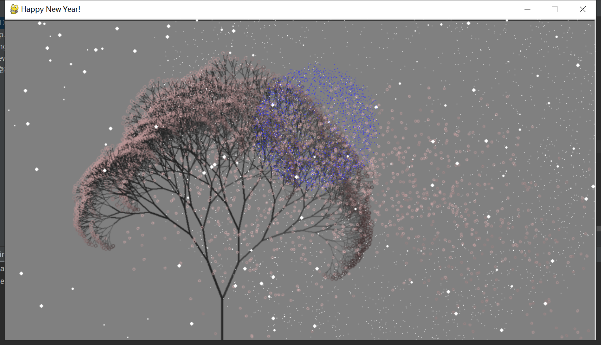

# SnowFirework

本程序非原创，借鉴于网上流传甚广的烟花与雪花代码，本人只是将两段程序结合起来，并稍微调整了一下结构使其更加清晰，仅供学习之用，如有侵权，联系删除。

本项目的github链接如下：https://github.com/Mr-Nan05/SnowFirework

接下来分三个部分简单介绍一下

### 基本参数

需要用到的第三方库如下

```python
import pygame
import math
import random
```

一些基本参数如下，比较容易理解，就不多介绍了

```python
# 窗口大小设置
WIN_W = 1000
WIN_H = 544

t1 = 0.18  # 时间流速
show_n = 0
show_frequency = 0.002  # 烟花绽放频率，数值越大频率越高

# 每一个列表都是一个颜色的三元组
color_list = [
                [255, 50, 50],
                [50, 255, 50],
                [50, 50, 255],
                [255, 255, 50],
                [255, 50, 255],
                [50, 255, 255],
                [255, 255, 255]
             ]
```

### 背景设置

包括背景音乐，背景图片，窗口大小等，功能已经分配清楚，注释也比较清楚，就直接放在这里了

```python
class BackGround:
    img_path = "flower.png"
    # img_path = 'HNY.jpg'
    msc_path = 'alarm.mp3'
    img_size = (WIN_W, WIN_H)

    def __init__(self):
        # 初始化 pygame
        pygame.init()
        # 创建时钟对象
        self.clock = pygame.time.Clock()
        self.bgp_set()
        self.bgm_set()

    # 背景图片以及窗口设置
    def bgp_set(self):
        # 设置屏幕宽高，根据背景图调整
        self.screen = pygame.display.set_mode(self.img_size)
        pygame.display.set_caption("Happy New Year!")
        self.bgp = pygame.image.load(self.img_path)

    # 背景音乐及播放时长设置
    def bgm_set(self):
        # 添加音乐
        pygame.mixer.music.load(self.msc_path)  # 加载音乐文件
        pygame.mixer.music.play()  # 播放音乐流
        pygame.mixer.music.fadeout(99999999)  # 设置音乐结束时间
```

### 烟花绽放

此部分基本完全来自与网上，具体解释参照此博客，以及感谢帮助

博客链接：https://blog.csdn.net/wulishinian/article/details/105248757

烟花的类代码附上如下，每一个烟花都是一个Fireworks的实例化对象

```python
class Fireworks:
    is_show = False
    x, y = 0, 0
    vy = 0
    p_list = []
    color = [0, 0, 0]
    v = 0

    def __init__(self, x, y, vy, n=300, color=[0, 255, 0], v=10):
        self.x = x
        self.y = y
        self.vy = vy
        self.color = color
        self.v = v
        for i in range(n):
            self.p_list.append([random.random() * 2 * math.pi, 0, v * math.pow(random.random(), 1 / 3)])

    def again(self):
        self.is_show = True
        self.x = random.randint(WIN_W // 2 - 350, WIN_W // 2 + 350)
        self.y = random.randint(int(WIN_H / 2), int(WIN_H * 3 / 5))
        self.vy = -40 * (random.random() * 0.4 + 0.8) - self.vy * 0.2
        self.color = color_list[random.randint(0, len(color_list) - 1)].copy()
        n = len(self.p_list)
        self.p_list = []
        for i in range(n):
            self.p_list.append([random.random() * 2 * math.pi, 0, self.v * math.pow(random.random(), 1 / 3)])

    def run(self):
        global show_n
        for p in self.p_list:
            p[1] = p[1] + (random.random() * 0.6 + 0.7) * p[2]
            p[2] = p[2] * 0.97
            if p[2] < 1.2:
                self.color[0] *= 0.9999
                self.color[1] *= 0.9999
                self.color[2] *= 0.9999

            if max(self.color) < 10 or self.y>WIN_H+p[1]:
                show_n -= 1
                self.is_show = False
                break
        self.vy += 10 * t1
        self.y += self.vy * t1
```

将烟花的实例化对象放在这个列表中

```python
fk_list = [Fireworks(300, 300, -20, n=100, color=[0, 255, 0], v=10),
           Fireworks(300, 300, -20, n=200, color=[0, 0, 255], v=11),
           Fireworks(300, 300, -20, n=200, color=[0, 0, 255], v=12),
           Fireworks(300, 300, -20, n=500, color=[0, 0, 255], v=12),
           Fireworks(300, 300, -20, n=600, color=[0, 0, 255], v=13),
           Fireworks(300, 300, -20, n=700, color=[255, 0, 0], v=15),
           Fireworks(300, 300, -20, n=800, color=[255, 255, 0], v=18)]
```

控制烟花绽放的代码如下，其中background就是BackGround的实例化对象

```python
def firework(background):
    # 放烟花
    global show_n
    global show_frequency
    for i, fk in enumerate(fk_list):
        if not fk.is_show:
            fk.is_show = False
            if random.random() < show_frequency * (len(fk_list) - show_n):
                show_n += 1
                fk.again()
            continue
        fk.run()
        for p in fk.p_list:
            x, y = fk.x + p[1] * math.cos(p[0]), fk.y + p[1] * math.sin(p[0])
            if random.random() < 0.055:
                background.screen.set_at((int(x), int(y)), (255, 255, 255))
            else:
                background.screen.set_at((int(x), int(y)), (int(fk.color[0]), int(fk.color[1]), int(fk.color[2])))
```

### 雪花飘落

此部分代码已经来源网络，具体代码解释参照如下博客链接，感谢兄台，如有侵权，联系删除

博客链接：https://blog.csdn.net/weixin_48923393/article/details/110508756

基本逻辑是使用一个列表存储随机产生的每一片雪花的位置与其他参数，然后做一个循环，使所有的雪花缓慢飘落

产生雪花的代码如下

```python
# 雪花列表
snow_list = []

def snowflake(background):
    for i in range(150):
        x_site = random.randrange(0, background.img_size[0])  # 雪花圆心位置
        y_site = random.randrange(0, background.img_size[1])  # 雪花圆心位置
        shift = random.randint(-1, 1)  # x 轴偏移量
        radius = random.randint(4, 6)  # 半径和 y 周下降量
        snow_list.append([x_site, y_site, shift, radius])
```

然后使用下面的函数遍历雪花列表，循环飘落，具体代码解释还是参照原博客

```python
def snowing(background):
    # 雪花列表循环
    for i in range(len(snow_list)):
        # 绘制雪花，颜色、位置、大小
        pygame.draw.circle(background.screen, (255, 255, 255), snow_list[i][:2],
                           snow_list[i][3] - 3)
        # 移动雪花位置（下一次循环起效）
        snow_list[i][0] += snow_list[i][2]
        snow_list[i][1] += snow_list[i][3]
        # 如果雪花落出屏幕，重设位置
        if snow_list[i][1] > background.img_size[1]:
            snow_list[i][1] = random.randrange(-50, -10)
            snow_list[i][0] = random.randrange(0, background.img_size[0])
```

### 二者结合

做一个循环，将调用二者的方法放在一起，可以通过控制snowing方法和firework方法的调用比例来调整二者的相对速率

具体代码如下

```python
def show(background):
    done = False
    while not done:
        # 消息事件循环，判断退出
        for event in pygame.event.get():
            if event.type == pygame.QUIT:
                done = True
        background.screen.blit(background.bgp, (0, 0))

        # 雪花飘落
        snowing(background)

        # 放烟花，可以通过控制snowing方法和firework方法的调用比例来调整二者的相对速率
        # firework(background)
        firework(background)

        # 刷新屏幕
        pygame.display.flip()
        background.clock.tick(20)
        # 退出
    pygame.quit()
```

最后将整个调用过程放在一起

```python
if __name__ == "__main__":
    bg = BackGround()
    snowflake(bg)
    show(bg)
```

### 运行效果

将运行结果简单截了几张图，如果视频无法播放请移步github下载观看，谢谢

<video src="运行示例.mp4"></video>




